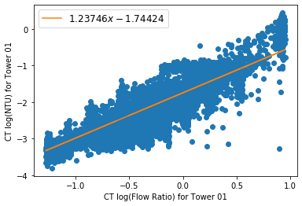

# Braun Cooling Tower Model

## Determining $c$ and $n$

To determine $c$ and $n$, typically using existing data for NTU,
$\dot{m}_w$ and $\dot{m}_a$

For most systems, the condenser water pumps are constant speed, and so
can estimate the mass flow rate of the water based on the number of
operating CW pumps.

The mass flow rate for air is normally assumed to have a linear
relationship with the VFD speed command. The design air flow at maximum
speed is usually known from the manufacturer.

For NTU, you can rearrange Eq. 9 from the paper to solve for NTU as a
function of $\epsilon_a$ and $m^{*}$.

$$
\textrm{NTU} = \frac{\ln \left( \frac{1 - \epsilon_{a}}{ 1 - m^{*} \epsilon_{a}}  \right) }{ m^{*} - 1 }
$$

In code:

```
NTU = LN((1 - epsilon_a) / (1 - m_star * epsilon_a)) / (m_star - 1)
```

$\epsilon_a$ can be solved for using Equation 8 and operational data.

- $Q$ is typically derived from the water side of the energy balance,
  known from the measured supply and return temperatures of the water,
  and the water flow is typically known based on the number of pumps
  operating.
- $\dot{m}_a$ is known using the logic explained above.
- $h_{s,w,i}$ is the saturation enthalpy of air at the temperature of
  the return CW. Return CW temperature is typically measured and the
  saturation enthalpy is calculated via psychrometrics.
- $h_{a,i}$ is a known measured value.

$m^{*}$ (Eq 10) is known from the two flow rates, air and water. The
specific heats, including the $C_s$ value can be calculated from
measured quantities.

$$
m^{*} = \frac{\dot{m}_{a} C_{s} }{ \dot{m}_{w} C_{pw} }
$$

With historical NTU, $\dot{m}_w$, and $\dot{m}_a$ values, you can run a
linear best fit to get $c$ and $n$.

Taking the logarithm on both sides of Eq 18 gives:

$$\log (NTU) = \log\left(c \left[ \frac{\dot{m}_w}{\dot{m}_a}   \right]^{1 + n} \right) $$

$$\log (NTU) = \log(c) + (1 + n) \log\left(\left[ \frac{\dot{m}_w}{\dot{m}_a} \right] \right) $$

Pattern matching with linear function to regress against

$$ y = A + Bx $$

So,

$$ c = e^{A} $$

$$ n = B - 1 $$

Here's an example of an actual data set we regressed to get $c$ and $n$
coefficients. From the coefficients here,

$$ c = e^{-1.74424} = 0.17478 $$

$$ n = 1.23746 - 1 = 0.23746 $$


