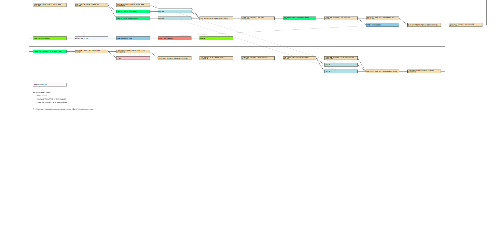

# Building Energy Modeling

## Default PLR curves

For AHUs with constant setpoint:

$$ FFLP = 0.00153 + 0.005208 PLR + 1.108624 PLR² + -0.11636 PLR³ $$


## EnergyPlus

- Plant only model, use `LoadProfile:Plant` to simulate the measured loads.

- Only two objects are required for every simulation: `Building` and `GlobalGeometryRules`.

- For Plant Loops/Air side Loops, only one splitter and one mixer are allowed per side.
  This is tremendously frustrating, but is the current limitation.
  Therefore, almost always going to have the following boilerplate

```idf
ConnectorList,
  CHW Supply Connector List, ! Name RefList: [ConnectorLists], REQ, #1
  Connector:Splitter,        ! Connector 1 Object Type [Connector:Splitter, Connector:Mixer], REQ, #2
  CHW Supply Splitter,       ! Connector 1 Name [PlantConnectors], REQ, #3
  Connector:Mixer,           ! Connector 2 Object Type [Connector:Splitter, Connector:Mixer], #4
  CHW Supply Mixer;          ! Connector 2 Name [PlantConnectors], #5

! Min Fields: 3
Connector:Splitter,
  CHW Supply Splitter, ! Name RefList: [PlantConnectors], REQ, #1
  ,                    ! Inlet Branch Name [Branches], REQ, #2
  ;                    ! Outlet Branch 1 Name [Branches], REQ, #3

! Min Fields: 3
Connector:Mixer,
  CHW Supply Mixer, ! Name RefList: [PlantConnectors], REQ, #1
  ,                 ! Outlet Branch Name [Branches], REQ, #2
  ;                 ! Inlet Branch 1 Name [Branches], REQ, #3

```

- Another limitation of plant loops is that you cannot have a pump in both the parallel portion of the side and the series portion of the side.
  The consequence of this is that for a constant primary/variable secondary system, the secondary pumps have to actually be placed on the "Demand" side of the loop.



- To run `HVAC-Diagram.exe` to make the node SVG, you need to be in the working directory with the `.bnd` file, and the file needs to be named `eplusout.bnd`. It is called with no arguments.


## timestep (program)

[link](https://michaelsweeney.github.io/timestep/)

## BEST (Best Energy Software Tools) Directory

<https://www.buildingenergysoftwaretools.com/>. Useful repository of software related to building energy modeling.

## Performance considerations

From <https://unmethours.com/question/37681/energyplus-simulation-run-time-diagnostics/>

> Until that work is complete, here are some things known to cause high run times (an incomplete list):
>
> - Lots of zones
> - Lots of surfaces
> - Plenums that connect to lots of surfaces / zones
> - Stratified water heaters
> - Individual air loop / plant loops / zone equipment for each zone in a multi-zone model
> - Lots of shading and high resolution shading/daylighting calculations
> - 20+ design days

## Chilled Beam (DOE-2)

<https://unmethours.com/question/97391/chilled-beam-modeling-in-equestdoe-22/>

## Post-processing

- <https://andrewmarsh.com/software/data-view2d-web/>

## Service Water Heating

See Chapter 51 of Applications, Table 6 for Office buildings, average 1.0 gal/person/day.

## Fan Curves

<https://unmethours.com/question/18763/what-is-the-source-for-the-vav-fan-power-coefficients-in-the-doe-commercial-reference-buildings/>
<https://docs.google.com/spreadsheets/d/1x23yuXX55CKhWko0EUtmF-zWJxLA1e29igFlzi5DqDY/edit?gid=0#gid=0>

> The key sources for fan curves are:
>
> - 2013 Title 24 NR ACM Manual (p.4-87)
> - CEC-2003 Advanced Variable Air Volume System Design Guide Appendix 5 DOE-2 Fan Curves
- > 90.1-2007 Appendix G Table G3.1.3.15 Part-Load Fan Power Equation
> - ASHRAE 90.1-2010 PRM Reference Manual p3.134
> The ones for variable volume fans in the Commercial Reference Buildings use the CEC-2003 reference for "Good SP Reset VSD Fan":
>
> Created by Jeff Stein 5-5-03
>
> These fan curves were developed using the Characteristic System Curve Fan Model developed by Stein and Hydeman.
> Curves include part load performance of the fan, belt, motor, and VSD.
>
> This is based on a plenum airfoil fan on a system curve through 0.5"

90.1 Curve Method 2, TABLE G3.1.3.15

P = 0.0013 + 0.1470 PLR + 0.9506 PLR² - 0.0998 PLR³

CEC-2003 Advanced Variable Air Volume System Design Guide Appendix 5 DOE-2 Fan Curves

Typical VSD Fan [0.047182815, 0.130541742, -0.117286942, 0.940313747]

Good SP Reset VSD Fan [0.040759894, 0.08804497, -0.07292612, 0.943739823]

No SP Reset VSD Fan [0.070428852, 0.385330201, -0.460864118, 1.00920344]

## Polygon to Convex

<https://mathoverflow.net/questions/60212/partitioning-a-polygon-into-convex-parts>

## Key Assumptions

- Envelope
    - Windows
        - U-value
        - SHGC
    - Walls, Roof, Doors
        - U-value

- Loads
    - People
    - Equipment
    - Lighting

- Schedules
    - Occupancy
    - Lighting
    - Equipment On/Off

- Minimum Outdoor Air Flow
    - 62.1 Calcs

- Minimum Terminal Unit Air Flow

## Plug Loads

References:

- ASHRAE 90.1 User's Manual
- Plug and Process Loads Capacity and Power Requirements Analysis,
  Michael Sheppy and Luigi Gentile-Polese, National Renewable Energy Laboratory,
  Scott Gould, Stanford University, September 2014
- From NREL: Technical Support Document: Strategies for 50% Energy Savings in Large Office Buildings
  - 65 W/person baseline
  - 48 W/person EnergyStar?
