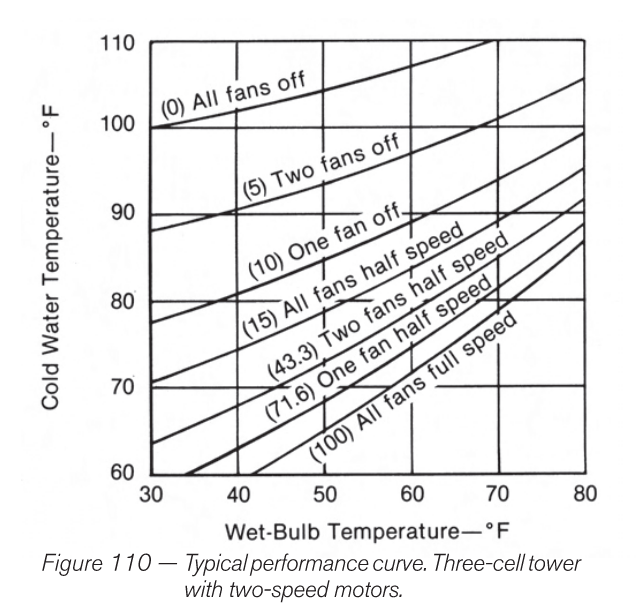

# Cooling Towers

## Variable Flow over Cooling Towers

From presentation on 2021-03-10: `2021-03-10_ashrae_variable_flow_over_cooling_towers.pdf`

- Safer and easier to implement for cross flow cooling towers
  - Can generally turn down to 30% of design for cross flow
  - Only can turn down to 70% or so for counter flow.

- Can use nozzle cups for cross flow towers.

## Rules of thumb for CFM

From [forum](http://www.refrigeration-engineer.com/forums/showthread.php?46112-Cooling-Tower-CFM-Per-Ton), state 250 CFM/ton.
This may have been based on this [source?](https://www.cedengineering.com/userfiles/Heat%20Rejection%20Options%20R1.pdf)

See Bhatia Heat Rejection Options.

EnergyPlus uses the following assumption for air flow rate, I/O `CoolingTower:TwoSpeed`.
190 is pressure rise, in Pa. V is in m3/s. P is power in watts.

$$
V = \frac{0.5 Power}{190}
$$


## Typical Performance Curves

Straight-ish line plotting CWST (Y) vs. Wet-bulb temperature (X).




## YorkCalc

Based on paper:

"CALIBRATION OF AN ENERGYPLUS CENTRAL COOLING PLANT MODEL WITH MEASUREMENTS AND INTER-PROGRAM COMPARISON"

The coefficients are:
Y = Approach = CWST - Twb

Twb
Tr = CWRT - CWST
LG = (mw / mwd) / (ma / mad)

where d is for design.

27 coefficients. All combinations up to cubic for all parameters.

Parameters are ordered in this programmatic order:

```
for lg = 0 to 2:
 for r  = 0 to 2:
  for wb = 0 to 2:
```

References:

- <http://www.cheresources.com/content/articles/heat-transfer/cooling-towers-design-and-operation-considerations>
  - Basic formulas, references calculation using the 'Chebyshev numerical method'.

## Merkel Model

Fundamental equation is:

$$
dq_{w} = L c_{p} dt = K_{L} a \left( t - t" \right) dV
$$

 - $L$ is water mass flow rate.
 - $c_{p}$ is specific heat of water.
 - $dt$ temperature differential of the bulk water
 - $K_{L}$ Unit conductance, heat transfer, bulk water to interface BTU/h-ft²-°F
 - $a$ = area of the interface, expressed per unit volume ft²/ft^3
 - $dV$ = differential volume


Have often come across sources that neglect the $c_{p}$ term.


## Software

- [Fluidika](https://www.fluidika.com/)
  - Make cooling tower calculation software.
  - $649 for Version 2.
  - References of note from manual:
    -  Benton, D. J., and Waldrop, W. R., Computer Simulation of Transport Phenomena in Evaporative Cooling
       Towers, ASME J. Eng. for Gas Turbines and Power, vol. 10, pp. 190–196, 988.
    -  Klimanek, A., Bialecki, R. A., Solution of Heat and Mass Transfer in Counterflow Wet-Cooling Tower Fills,
       International Communications in Heat and Mass Transfer, 36 (2009), 6, pp. 547-553
    -  Kloppers, J. C., and Kroger, D.G., Loss Coefficient Correlation for Wet-Cooling Tower Fills, Applied Thermal Engineering, vol. 23, no. 17, pp. 2201–2211, 2003.

- The paper at [SPX cooling](http://spxcooling.com/wp-content/uploads/TB-R61P13.pdf) is actually a recreation of a important paper from 1960 which is used in detail in the ASHRAE handbook.

- From GitHub
  - Found <https://github.com/tothpeti96/coolingTower>

## ASHRAE

I recreated Table 1 from the ASHRAE HVAC Systems and Equipment Handbook. Located at:

`hvac/Cooling Tower Performance Calculations.xlsx`

## Cooling Tower Tons

Simple number is 15,000 BTU/hr, which comes from the fact that there is around 25% extra heat load that has to be accounted for from the electricity input.
Also equates to 3 GPM of CW going from 95°F to 85°F at 78°F wet bulb.
Source: Chapter 40 ASHRAE HVAC Systems and Equipment.

## Water Treatment

- [Conductivity][Sensorex] is easy measurement to account for mineral concentration.
- [CT Best Practices][EERE]

Make-Up = Evaporation + Blowdown + Drift + Leaks/Overflows

 - Evaporation: H2O in gas/vapor form, the minimum amount of mass loss that would be desired, where the cooling comes from
 - Drift: H20 leaving in liquid water droplet form. Bad loss.
 - Blowdown: Basically flushing water down drain on purpose to dilute dissolved solids.
 - Leaks/Overflows: What you think they are.

## Example L/G ratios

- 2.60 to 3.25 from <https://www.ijsrp.org/research-paper-0418/ijsrp-p7631.pdf>, <http://dx.doi.org/10.29322/IJSRP.8.4.2018.p7631>


[Sensorex]: https://sensorex.com/2022/05/16/effects-high-conductivity-cooling-tower-water/
[EERE]: https://www.energy.gov/eere/femp/best-management-practice-10-cooling-tower-management
