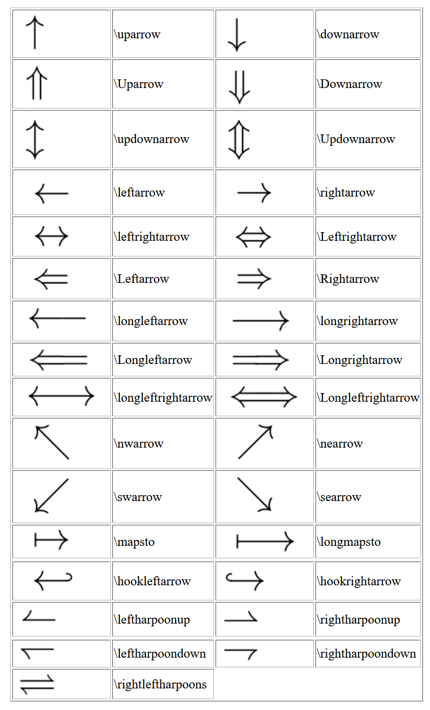

# LaTex

## Arrows




## Hyperref warning - Token not allowed in a PDF string

Solution: [Stack Exchange](https://tex.stackexchange.com/questions/10555/hyperref-warning-token-not-allowed-in-a-pdf-string)

Appears to normally be caused by having TeX commands in a location that
get turned into a hyperref link. For `elsarticle`s, the place it showed
up for me is in the `\author` command. Use `\texorpdfstring{tex
stuff}{pdf stuff - normally empty}` to get around the issue.

```tex
\author{Mitchell T. Paulus \texorpdfstring{\corref{cor1}\fnref{fn1}}{}}
```

## TeX Live

- Update `tlmgr`: `[sudo] tlmgr update --self`
- Update all packages: `[sudo] tlmgr update --all`
- List what would be updated: `[sudo] tlmgr update --list`
- Install package: `[sudo] tlmgr install [option...] pkg...`

Based on my testing, `\maketitle{}` has to be after the abstract
definition.

## Abstract

```tex
\begin{abstract}

\end{abstract}
\maketitle{}
```

## Fonts

```tex
\usepackage{fontspec}
\setmonofont{fontname}[Scale=0.8]
\setmainfont{fontname.otf} % Load from file
```

I don't think Latex has the concept of setting a different font size
outside of the main one set at the beginning of the document class.
Generally can use commands like `\big` etc. For `fontspec`, the concept
is similar, you can just apply a `Scale`, which is a fraction of the
main document size.

## Bibliographies

Stack Exchange answer: https://tex.stackexchange.com/questions/25701/bibtex-vs-biber-and-biblatex-vs-natbib

Packages: biblatex, natbib
Preprocessing Programs (.bib -> .bbl): biber, BibTeX

Database files: .bib (biber has extended options vs. BibTeX)

Basic `biblatex` usage:

```latex
\usepackage{biblatex}
\addbibresource{bib.bib}
\cite{key}
\printbibliography[options]{}
```

For no heading, use option `heading=none` in the `printbibliography` statement.

biber and biblatex are the newer programs. Key features for `biber`:

1. Full Unicode support (huge)
2. Can better handle names (given, family, prefix, etc.)

### `.bib` file format

4 types of entries:

1. @STRING { identifier = "Value" }
2. @PREAMBLE { ? }
3. @COMMENT { "Any comment" }
4. @entry {id, tags = "values", ... }

**Tags**

- Case insensitive
- Can surround with either curly braces or quotations. Escape either of these with '\' if required.

### `biber` and `biblatex` with `elsarticle`

[See answer here](https://tex.stackexchange.com/a/511500/237947). Use
`nonatbib` option for `elsarticle`, like

```tex
\documentclass[nonatbib]{elsarticle}
\makeatletter
\let\c@author\relax
\makeatother
```

### Biblatex compilation

Normally goes:

1. `pdflatex` or `lualatex`, etc. -> should generate .bcf file during
   compilation if the `biblatex` package is used.
2. `biber <basename>`
3. `pdflatex` or `lualatex`, etc. until convergence.


### Bibtex gotchas

Had non ASCII characters in the .bib file on accident. `bibtex` does not
gracefully handle this situation.

### Basic compilation steps

[link](https://tex.stackexchange.com/questions/204291/bibtex-latex-compiling)

[Another link showing the pitfalls of trying to compile while using
--output-directory option](https://tex.stackexchange.com/questions/12686/how-do-i-run-bibtex-after-using-the-output-directory-flag-with-pdflatex-when-f)


### TexLive

- Prefer to manually download and manage vs. using package manager.
- Download `install-tl-xxxxxxx.tar.gz` file
- Extract: `tar -xvf install-tl-xxxxxxx.tar.gz`
- Probably best to install to user owned location.
    - From [here](https://stackoverflow.com/a/29784261/5932184), can use
      the two environment variables
        - TEXLIVE_INSTALL_PREFIX=/home/user/texlive
        - TEXLIVE_INSTALL_TEXDIR=/home/user/texlive/YYYY

## Remove page numbering

```tex
\pagestyle{empty}
\thispagestyle{empty} % For single page
```
## Colors

```tex
\definecolor{mypink1}{rgb}{0.858, 0.188, 0.478}
\definecolor{mypink2}{RGB}{219, 48, 122}
\definecolor{mypink3}{cmyk}{0, 0.7808, 0.4429, 0.1412}
\definecolor{mygray}{gray}{0.6}
\definecolor{color}{HTML}{FFAABB}
```

## Font Sizes

```tex
\tiny \scriptsize \footnotesize \small \normalsize \large \Large \LARGE \huge \Huge
```

## Relax

`\relax` is a single token, a noop. Used often to stop expansion of
another command.

## New Environments

```
\newenvironment{name}[numargs][Default arg1]...{stuff before}{stuff after}
```

## siunitx

From v2 to v3, the option `number-unit-product` was changed to
`quantity-product`.

## References

[Not so short introduction to Latex2e](https://tobi.oetiker.ch/lshort/lshort.pdf)


## Percent % after Curly Brace `{`

- <https://tex.stackexchange.com/questions/40946/why-the-end-of-line-in-macro-definitions>
- Prevents TeX from turning end of line character into space.


## Personal Tex Files

```
% Find personal directory location
kpsewhich -var-value=TEXMFHOME
```

## Tex Directory Structure (TDS)

Source documentation: <https://tug.org/tds/tds.pdf>

```
$HOME/texmf/tex/latex/myfile.tex
```

## Hyperref

<https://www.overleaf.com/learn/latex/Hyperlinks>

To remove boxes, confusingly set `colorlinks` to `true`. This makes the links colored.
To remove that color, specify that the `linkcolor` be black.

```tex
\hypersetup{
  hyperindex=true,   % Makes the page numbers of index entries into hyperlinks
  linktocpage=false, % Makes the page numbers instead of the text to be link in the Table of contents.
  breaklinks=false,  % Allows links to be broken into multiple lines.
  colorlinks=false,  % Colours the text for links and anchors, these colours will appear in the printed version
  linkcolor=red,     % Colour for normal internal links
  anchorcolor=black, % Colour for anchor (target) text
  citecolor=green,   % Colour for bibliographical citations
  filecolor=cyan,    % Colour for links that open local files
  urlcolor=magenta,  % Colour for linked URLs
  frenchlinks=false, % Use small caps instead of colours for links
}
```

## Authors and Affiliation

```
\usepackage{authblk}

\author[1,2]{name}
\author[3]{other}
\affil[1]{ something }
\affil[2]{ something else}

```

[Comprehensive symbol list](http://mirrors.ctan.org/info/symbols/comprehensive/symbols-letter.pdf)
